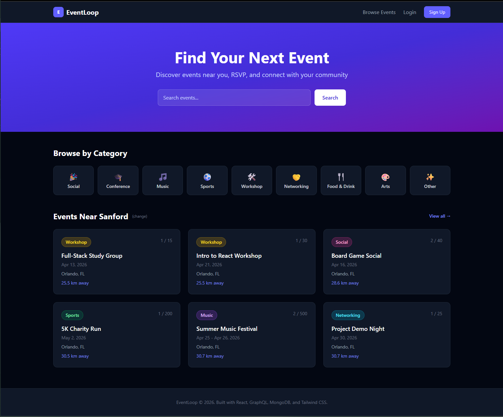
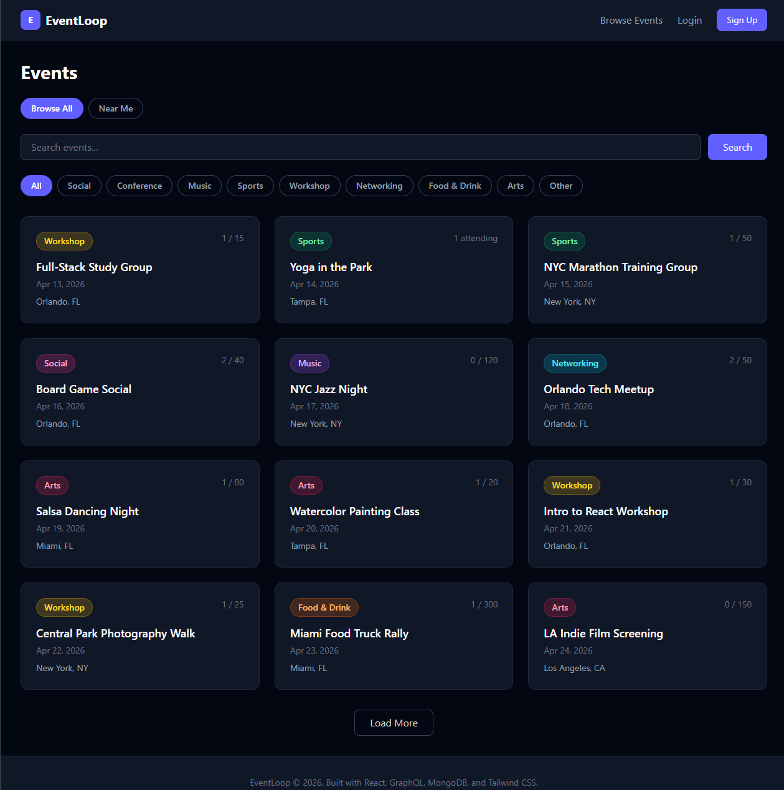
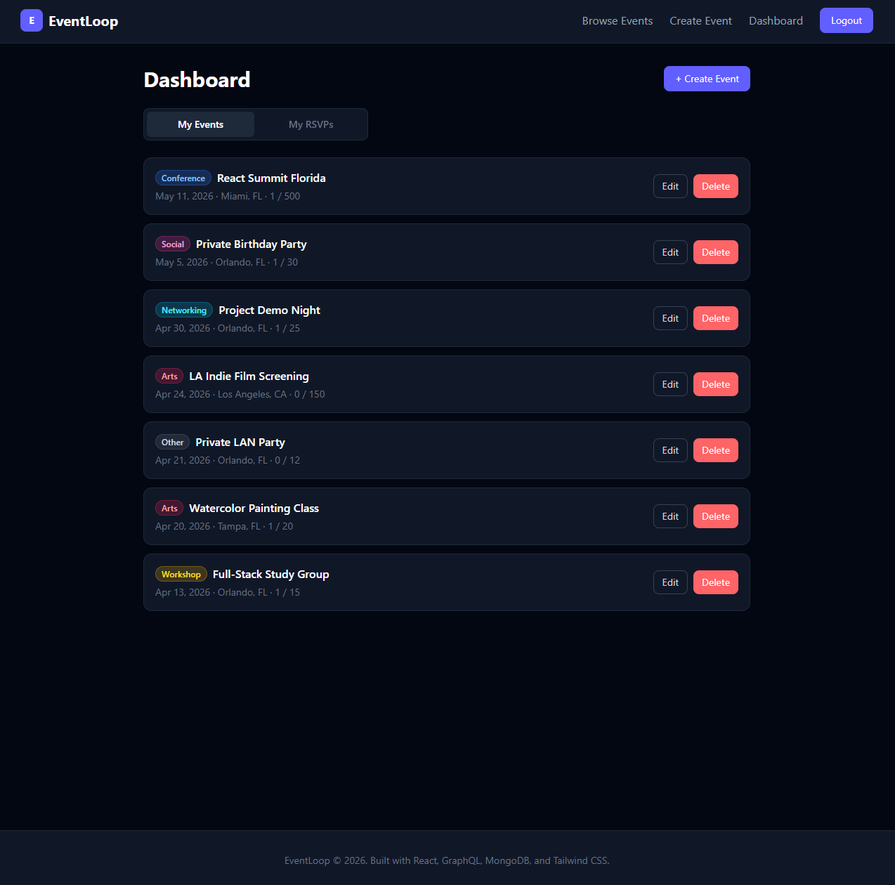
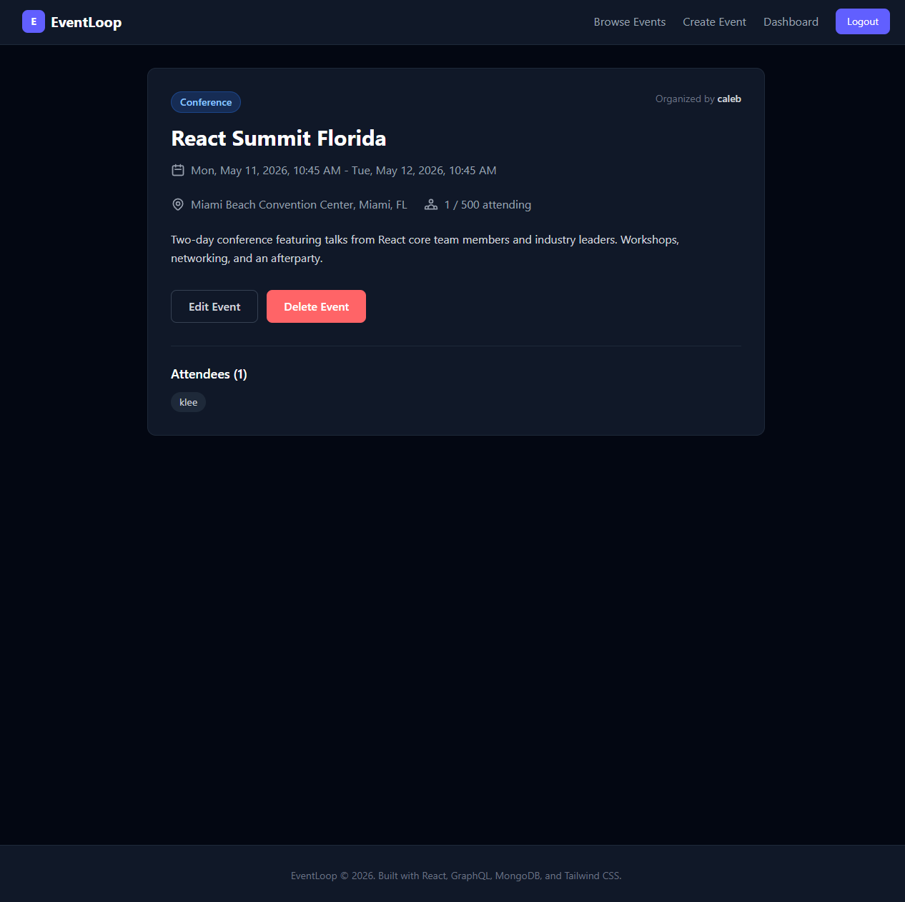

## Project Overview

**Project Name:** Event Loop

An event planning and RSVP platform where users can create events, browse by category and location, and RSVP. Built with the MERN stack and GraphQL.

**Program:** UCF Split Stack Software Engineering Program

**Track:** Back End

**Team Members:**
- [Caleb Liljeros, did everything]

## Problem Statement

- **Target Users:** Community members, event organizers, and social groups looking to discover and share local events
- **Pain Points:** Existing platforms are cluttered, hard to search by location, or require complex setup to create events
- **Proposed Solution:** A streamlined event platform with location-aware browsing, instant RSVP, and a clean dark-mode interface that makes finding and creating events effortless

## Core Features

- **JWT Authentication** - Secure signup/login with protected routes
- **Event CRUD** - Create, edit, and delete events with geocoded locations
- **Location-Aware Home Page** - Automatically shows nearby events based on saved location
- **Geospatial Search** - Find events near any city using MongoDB's $geoNear with configurable radius
- **RSVP System** - Attend, maybe, or cancel RSVPs with capacity enforcement
- **Category Filtering** - 9 event categories with color-coded badges
- **Text Search** - Full-text search across event titles and descriptions
- **Private Events** - Events can be marked private (only visible to the organizer)
- **Responsive Dark Mode UI** - Mobile-friendly design built with Tailwind CSS v4

## Tech Stack

| Layer | Technology |
|-------|-----------|
| **Frontend** | React 18, TypeScript, Vite |
| **Backend** | Node.js, Express 4, Apollo Server 5 |
| **API** | GraphQL (queries + mutations) |
| **Database** | MongoDB Atlas, Mongoose ODM |
| **Auth** | JSON Web Tokens (JWT) |
| **Styling** | Tailwind CSS v4 |
| **Geocoding** | OpenStreetMap Nominatim API |
| **Testing** | Cypress (component tests) |
| **CI/CD** | GitHub Actions |
| **Deployment** | Render |

## Architecture Summary

```
Client (React + Vite + Tailwind)
  |
  | Apollo Client (useQuery / useMutation)
  | Authorization: Bearer <jwt_token>
  |
  v
/graphql endpoint (Apollo Server + Express)
  |
  | Context: { user } extracted from JWT
  |
  v
Mongoose Models (User, Event, Rsvp)
  |
  v
MongoDB Atlas
```

- Client communicates with the GraphQL API via queries and mutations
- Apollo Client's auth link injects the JWT on every request
- Server validates tokens in the context function (never throws - returns null for invalid tokens)
- Individual resolvers decide whether authentication is required
- MongoDB uses 2dsphere indexes for geospatial queries and text indexes for search

## Repository Structure

```
Event-Loop/
├── .github/workflows/     # CI (dev.yml) and CD (main.yml)
├── client/
│   ├── src/
│   │   ├── components/    # Header, Footer, EventCard, EventForm, RsvpButton, etc.
│   │   ├── pages/         # Home, Events, EventDetail, CreateEvent, EditEvent, Dashboard, Login, Signup
│   │   ├── graphql/       # Query and mutation definitions
│   │   └── utils/         # Auth, geocoding, location, date parsing, categories
│   └── ...
├── server/
│   ├── src/
│   │   ├── models/        # User, Event, Rsvp (Mongoose schemas)
│   │   ├── schemas/       # GraphQL typeDefs + resolvers
│   │   ├── seeds/         # Seed data and script
│   │   ├── utils/         # JWT auth utilities
│   │   └── config/        # Database connection
│   └── ...
├── cypress/               # Component tests
└── package.json           # Root orchestration (concurrently, scripts)
```

## Local Setup

### 1. Clone the repository

```bash
git clone https://github.com/calebliljeros-hash/Event-Loop.git
cd Event-Loop
```

### 2. Install dependencies

```bash
npm install
```

This installs root, server, and client dependencies via the `install` script.

### 3. Configure environment variables

Create `server/.env`:

```env
MONGODB_URI=mongodb://127.0.0.1:27017/eventloop
JWT_SECRET=your-secret-key-change-in-production
```

### 4. Seed the database

```bash
npm run seed
```

Creates 6 users, 26 events across 5 cities, and 32 RSVPs. All user passwords are `password123`.

### 5. Run the app

```bash
npm run develop
```

- Client: http://localhost:3000
- GraphQL Sandbox: http://localhost:3001/graphql

## Testing and Quality

- **Component Tests:** `npm run test-component` (Cypress)
- **Build Validation:** `npm run build`
- **CI Workflow:** [EventLoop - CI Tests](.github/workflows/dev.yml) runs on PRs to `develop`
- **CD Workflow:** [EventLoop - Deploy to Render](.github/workflows/main.yml) deploys on merge to `main`

## Deployment

- **Live App:** https://event-loop.onrender.com
- **GraphQL API:** https://event-loop.onrender.com/graphql
- **GitHub Repository:** https://github.com/calebliljeros-hash/Event-Loop

> Note: The free Render tier spins down after 15 minutes of inactivity. The first request after a cold start may take ~30 seconds.

## Screenshots






> To add screenshots: capture them from the deployed site and save as `screenshots/home.png`, `screenshots/browse.png`, `screenshots/dashboard.png`, `screenshots/event-detail.png` in the repo root.

## Future Improvements

- Add real-time event updates with GraphQL subscriptions
- Implement event image uploads
- Add email notifications for RSVP confirmations
- Expand test coverage with e2e tests
- Add calendar integration (Google Calendar, iCal export)
- Implement event comments/discussion threads

## License

MIT
